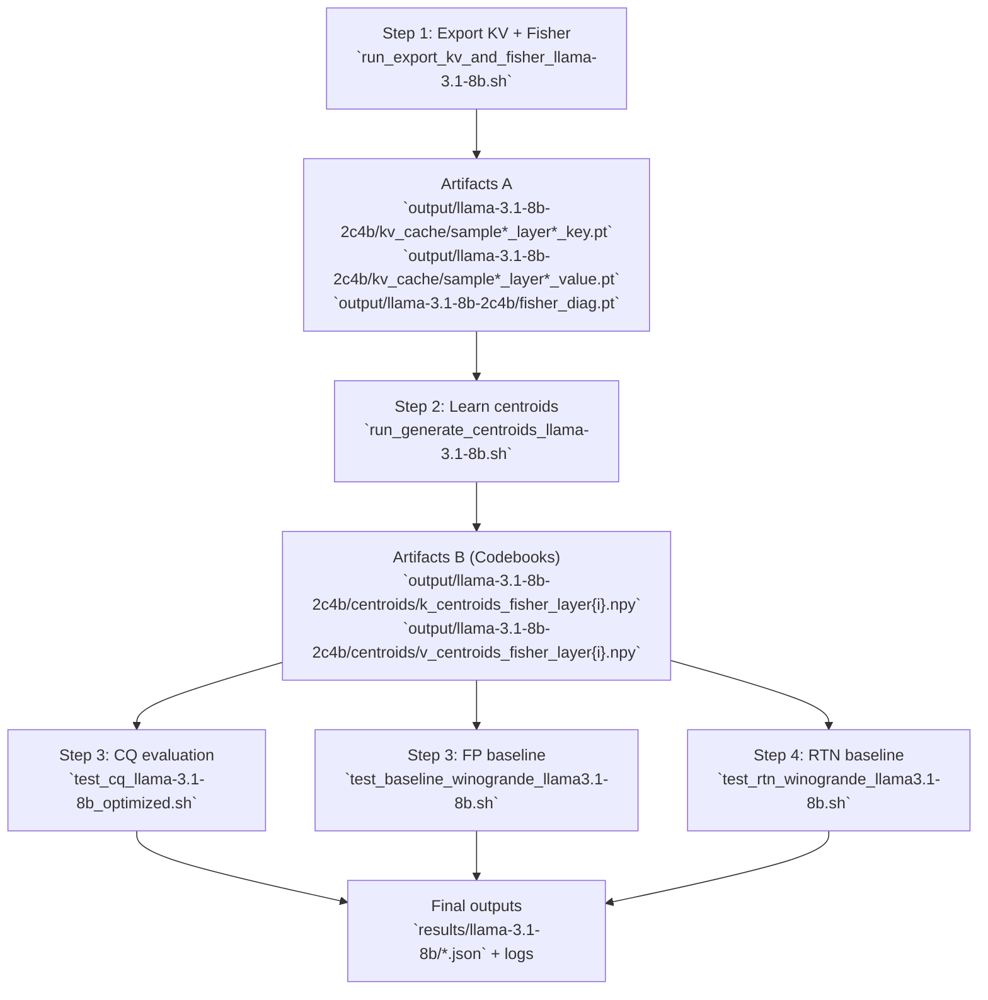

# LLMSim-CQ

This project extends `lm-evaluation-harness` to reproduce and evaluate:

- **CQ (Coupled Quantization) for KV-cache**
- **RTN per-tensor baseline**
- Main model target: `meta-llama/Llama-3.1-8B`

---

## What This Project Is About

Modern LLM inference is often bottlenecked not only by model weights, but by **KV-cache memory traffic** during autoregressive decoding.  
This project studies a practical question:

> Can we compress KV-cache aggressively while preserving downstream accuracy and language modeling quality?

To answer this, the repository builds a full reproduction pipeline around Coupled Quantization (CQ), including:

- calibration data collection from real model activations
- Fisher-aware codebook learning
- runtime integration into `lm_eval` evaluation flows
- side-by-side comparison against FP and RTN baselines

In short, this project is an engineering-focused reproduction of **accuracy-aware KV-cache compression** for real evaluation workloads.

---

## Method Intuition (Why CQ Works)

### 1) Coupled Quantization over channel groups

Instead of quantizing each channel independently, CQ groups multiple channels together (for example `2c`, `4c`, `8c`) and quantizes the group as one unit.  
This captures cross-channel structure in KV states and typically yields better fidelity under the same bit budget.

### 2) Fisher-weighted distortion objective

Not every channel contributes equally to loss.  
This project uses Fisher diagonal statistics as sensitivity weights, so codebook learning minimizes a **task-relevant weighted error** rather than plain MSE.

Conceptually:

- high-Fisher dimensions are "expensive to distort"
- low-Fisher dimensions can tolerate more quantization noise

This shifts quantization capacity toward what matters most for model behavior.

### 3) End-to-end evaluation

The method is validated on:

- downstream task metrics (for example Winogrande)
- perplexity behavior under `use_cache=True`

So results reflect actual inference-time quality, not only offline tensor reconstruction error.

---

## Project Status

- Baseline, RTN, and multiple CQ settings have been run successfully.
- The only remaining unfinished run is **`2c4b` full experiment**.
- Existing Winogrande outputs are under `results/llama-3.1-8b/` (for example `2c8b`, `4c8b`, `8c8b`).

---

## Environment Setup (Conda `vq`)

### 1) Enter the project directory

```bash
cd LLMSim-CQ
```

### 2) Create the `vq` environment (one-time)

```bash
conda create -n vq python=3.10 -y
```

### 3) Activate the environment

```bash
conda activate vq
```

### 4) Install dependencies for this project

```bash
pip install -U pip setuptools wheel
pip install -e .
pip install torch transformers datasets accelerate sentencepiece
```

What gets installed:

- Core harness dependencies from `pyproject.toml` via `pip install -e .`
- Runtime essentials used by your scripts:
  - `torch`
  - `transformers`
  - `datasets`
  - `accelerate`
  - `sentencepiece`

### 5) (Optional) Start an interactive Slurm session

```bash
srun -p athena-genai -t 24:00:00 -w node5 --pty bash
```

---

## Artifact Diagram



---

## Quickstart (Fast Reproduction Path)

If you want a minimal end-to-end CQ run (currently configured for `2c4b`):

```bash
# Step 1: export KV activations + Fisher diagonal
bash run_export_kv_and_fisher_llama-3.1-8b.sh

# Step 2: generate per-layer centroids
bash run_generate_centroids_llama-3.1-8b.sh

# Step 3: run CQ on Winogrande
bash test_cq_llama-3.1-8b_optimized.sh

# Step 4: run FP baseline for comparison
bash test_baseline_winogrande_llama3.1-8b.sh
```

---

## Full Reproduction Steps

Use this sequence: **data export -> centroid learning -> downstream evaluation**.

> Scope note: all commands in this README refer to primary project files only (root and `scripts/`), and intentionally exclude any `trash/` directory content.

### Step 0. Directory conventions

- Export root (current script default):
  - `output/llama-3.1-8b-2c4b/`
- Centroid output:
  - `output/llama-3.1-8b-2c4b/centroids/`
- Evaluation outputs (both naming styles appear in scripts):
  - `result/llama-3.1-8b/`
  - `results/llama-3.1-8b/`

### Step 1. Export KV activations and Fisher

Run the helper script (currently set to `num_coupled_channels=2`, `num_bits=4`):

```bash
bash run_export_kv_and_fisher_llama-3.1-8b.sh
```

Equivalent core command:

```bash
python export_kv_and_fisher.py \
  --model "meta-llama/Meta-Llama-3.1-8B" \
  --output_dir "output/llama-3.1-8b-2c4b" \
  --num_samples 16 \
  --max_seq_len 2048 \
  --key_export_domain post_rope \
  --num_coupled_channels 2 \
  --num_bits 4 \
  --dataset "wikitext" \
  --dataset_config "wikitext-2-raw-v1"
```

Artifacts produced:

- `output/.../kv_cache/sample*_layer*_key.pt`
- `output/.../kv_cache/sample*_layer*_value.pt`
- `output/.../fisher_diag.pt`

### Step 2. Learn Fisher-weighted centroids per layer

```bash
bash run_generate_centroids_llama-3.1-8b.sh
```

This loops through layers `0..31` and calls `generate_centroids.py` for each layer.

Artifacts produced:

- `k_centroids_fisher_layer{i}.npy`
- `v_centroids_fisher_layer{i}.npy`

Saved at:

- `output/llama-3.1-8b-2c4b/centroids/`

### Step 3. Downstream evaluation (Winogrande)

#### 3.1 CQ run

```bash
bash test_cq_llama-3.1-8b_optimized.sh
```

Key check:

- CQ is enabled by passing `cq_codebook_dir` in `--model_args`.
- Confirm logs contain `Enabled CQ KV-cache quantization`.

#### 3.2 FP baseline run

```bash
bash test_baseline_winogrande_llama3.1-8b.sh
```

### Step 4. RTN baseline (optional)

```bash
bash test_rtn_winogrande_llama3.1-8b.sh
```

This uses `rtn_pertensor_bits=4` in `--model_args`.

### Step 5. Optional perplexity comparison (CQ vs FP)

1. Collect activations and Fisher diagonals (see `generate_all_fisher_codebooks_*.sh`).
2. Train per-layer Fisher-weighted CQ codebooks with `run_weighted_kmeans.py` (already automated in the helper script).
3. Enable the runtime patch and evaluate perplexity / downstream metrics with the new helper:

```bash
# CQ
python scripts/run_cq_eval.py \
  --model meta-llama/Llama-3.1-8B \
  --codebook-dir /path/to/centroids \
  --dataset wikitext \
  --dataset-config wikitext-2-raw-v1 \
  --limit 1 \
  --max-eval-tokens 131072

# FP baseline (disable CQ)
python scripts/run_cq_eval.py \
  --model meta-llama/Llama-3.1-8B \
  --codebook-dir /path/to/centroids \
  --disable-cq \
  --dataset wikitext \
  --dataset-config wikitext-2-raw-v1 \
  --limit 1 \
  --max-eval-tokens 131072
```

Add `--disable-cq` to obtain the FP baseline for comparison. The script exercises the quantized KV-cache during loss computation by forcing `use_cache=True`, matching the coupled quantization paper setup.

## Sanity Checks Before Long Runs

- Keep model IDs consistent (`Meta-Llama-3.1-8B` vs `Llama-3.1-8B` naming differences exist in scripts).
- Make sure `CUDA_VISIBLE_DEVICES` and `--device` target an available GPU.
- Ensure `cq_codebook_dir` contains complete 32-layer `k/v` centroid files.
- For pre/post RoPE comparison:

```bash
python -m lm_eval.run_models --model hf \
	--model_args pretrained=meta-llama/Llama-3.1-8B-Instruct,attn_implementation=eager,cq_codebook_dir=/path/to/fisher_weighted_codebook/llama-3.1-8b/4c8b \
	--tasks wikitext \
	--device cuda:6 \
	--limit 10
```

---

## Models Recorded in This Project

1. `google/gemma-3-12b-it`
2. `meta-llama/Llama-3.1-8B-Instruct`
3. `Qwen/Qwen3-4B-Instruct-2507`
4. `Qwen/Qwen3-4B-Thinking-2507`
5. `openai/gpt-oss-20b`